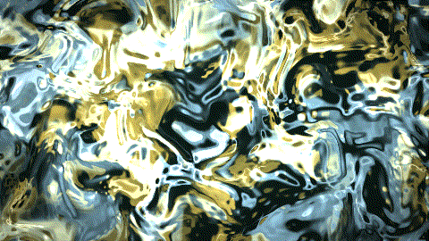
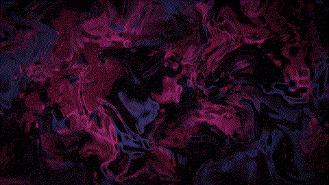
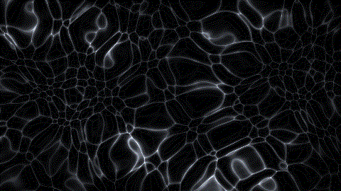
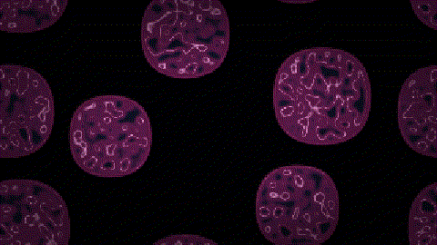
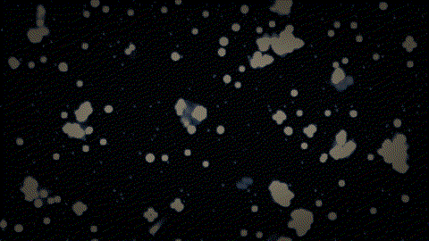

# GLSL Ink Wallpapers

Animated, texture-free GLSL 440 wallpapers for KDE Plasma **lock and login
screens**, rendered entirely on the integrated GPU. `ink`,
`ink-melancholy` and `caustics` install as Plasma QSB plugins (and ship as
Android live wallpapers); `life` and `mnca` are stateful cellular automata
served by the web preview.

## Preview

All GIFs: 480×270, 84 frames (QSB variants step 0.3 s of animation per
frame; feedback variants run one generation per frame).


**`ink`** — gold and pale-blue ink on deep green


**`ink-melancholy`** — dark rose and smoky violet ink on near-black plum


**`caustics`** — dark water caustics: glowing cell rims tapering to hot
vertex stars


**`mnca`** — multi-neighborhood cellular automaton: wine-and-steel bacterial
colonies on black


**`life`** — Game-of-Life soup with fade + ambient rain

Still frames: [ink](previews/ink.png) ·
[ink-melancholy](previews/ink-melancholy.png) ·
[contact sheet](previews/contact-sheet.png)

## How it works

**Stateless** (`ink`, `ink-melancholy`, `caustics` — QSB / Android). One
`ShaderEffect` per variant with the standard 80-byte Plasma UBO
(`qt_Matrix`, `qt_Opacity`, `time`, `resolution`). Texture-free fragment
stage: hash value noise, two domain warps, two color fields, `fwidth`
micro-detail. Non-repeating motion from per-frame hashes only — no state,
no loops: 8-second "weather" slots re-target eddies and drift direction,
counter-rotating eddies shear the structures past each other, pseudo-random
droplets travel at random 360° orientations and dissolve before leaving the
frame. Time is frame-synced via `FrameAnimation`.

**Feedback** (`life`, `mnca` — web preview). Stateful ping-pong FBO
automata; the QSB path must stay stateless, so these run only in the web
preview. Each `/frame` request advances `&gens=N` (1–200) generation(s) at
a fixed 320×180 grid, then composites to the requested resolution.
`life`: Conway over an RGBA8 soup with per-frame fade + ambient rain.
`mnca`: continuous Lenia-family automaton with three circular
neighborhoods (12/16/20 taps) through 4-parameter rule curves, plus
ambient reseed. Knobs: `&reset=1`, `&seed=N`,
`&u_name=value[,value...]`.

## Performance

Measured on the iGPU (Mesa 7.2.7 radeonsi, OpenGL ES 3.2 — the same driver
the wallpapers run under), medians of 30 runs after warmup.

**Stateless, per frame** (GL-only, what Plasma/Android executes):

| | 1280×720 | 1920×1080 | 2573×1440 (4K @ 67% `renderScale`) |
| --- | --- | --- | --- |
| `ink` | 2.4 ms | 5.4 ms | 9.5 ms |
| `ink-melancholy` | 2.9 ms | 6.4 ms | 11.6 ms |
| `caustics` | 4.1 ms | 9.2 ms | 16.7 ms |

**Feedback, per generation** (full step; the CA pass is a fixed 320×180
draw — 0.1 ms `life`, 0.2 ms `mnca` — resolution-independent):

| | 640×360 | 1280×720 | 1920×1080 | 2573×1440 |
| --- | --- | --- | --- | --- |
| `life` | 0.4 ms | 1.3 ms | 4.8 ms | 11.1 ms |
| `mnca` | 0.5 ms | 1.4 ms | 5.8 ms | 11.0 ms |

A 30 fps lock screen has a 33.3 ms budget: `caustics` at the 4K 67% lock
layer (16.7 ms) fits with room; at a 60 fps budget it is at the edge —
`renderScale` is the lever.

## Requirements

* KDE Plasma 5 or 6 (lock: `kscreenlocker`, login: `plasmalogin`)
* `qsb-qt6` to compile the shaders
  (Fedora: `sudo dnf install qt6-qtshadertools`)
* Python 3 + Pillow + a Mesa/EGL GPU — only for the preview tooling
  (web preview, GIFs, tests), **not** for the wallpapers themselves

## Building

```sh
scripts/build-packages.sh
```

compiles every `shaders/*.frag` into `shaders/*.frag.qsb` (via `qsb-qt6
--qt6`, the invocation Plasma's own pipeline uses) and assembles
installable plugin directories under `build/`:

```
build/org.local.axiom.lockwall.ink/
  contents/
    ui/
      main.qml            # ShaderEffect + FrameAnimation + renderScale
      ink.frag            # shader source (mirror, for reference)
      ink.frag.qsb        # compiled shader (what Plasma loads)
    metadata.json
```

Re-run this after any shader edit. `.qsb` files are build artifacts and
are not tracked in git — a fresh clone must run `scripts/build-packages.sh`
before installing. Never hand-edit `.qsb` files.

## Installing on a KDE system

### 1. Copy the plugin(s)

System-wide (needed for the **login screen**, which runs as the greeter
user and only sees system paths):

```sh
sudo cp -r build/org.local.axiom.lockwall.ink* /usr/share/plasma/wallpapers/
```

Per-user (lock screen and desktop only):

```sh
mkdir -p ~/.local/share/plasma/wallpapers
cp -r build/org.local.axiom.lockwall.ink* ~/.local/share/plasma/wallpapers/
```

### 2. Lock screen

**Plasma 6** (kscreenlocker 6.x) reads the greeter config from the
**`[Greeter]`** section of `~/.config/kscreenlockerrc`:

```ini
[Greeter]
WallpaperPlugin=org.local.axiom.lockwall.ink-melancholy
```

**Plasma 5** uses the `[kscreenlocker]` section instead:

```ini
[kscreenlocker]
WallpaperPlugin=org.local.axiom.lockwall.ink-melancholy
```

(Or pick the wallpaper in *System Settings → Screen Lock → Wallpaper*.)
A system-wide default may live in `/etc/xdg/kscreenlockerrc`; the user
file overrides it.

### 3. Login screen

`plasmalogin` reads `/etc/plasmalogin.conf`, greeter section
(`WallpaperPluginId`, not `WallpaperPlugin`):

```ini
[Greeter]
WallpaperPluginId=org.local.axiom.lockwall.ink-melancholy
```

Requires the **system-wide** copy from step 1.

### 4. Apply

* **Switch User / Login:** a new greeter process starts every time, so it
  picks up the new config automatically.
* **Lock screen:** `kscreenlocker_greet` caches the config for its whole
  lifetime. If it is already running, restart it once:

  ```sh
  kill "$(pgrep -f /usr/libexec/kscreenlocker_greet)"   # it respawns
  ```

### Uninstall

```sh
sudo rm -rf /usr/share/plasma/wallpapers/org.local.axiom.lockwall.ink*
# and restore the previous WallpaperPlugin / WallpaperPluginId values
# (remove the lines to fall back to the system default)
```

## Web preview

Serves every shader as live PNG frames on a phone-friendly page with GPU /
RAM stats. Runs its own headless Mesa/EGL renderer (surfaceless, AMD-only
ICD pinning), so it works without X.

```sh
python3 scripts/webserver.py --port 8090
# -> http://192.168.x.y:8090  (0.0.0.0 bind)
```

Endpoints: `/` (page), `/frame?variant=&res=WxH` (PNG), `/stats` (GPU busy
%, VRAM, fps, RAM), `/healthz`. Shader edits are picked up without a
restart (mtime-aware cache); restart after changing `RATE` in
`scripts/webserver.py`.

## Tests

```sh
python3 -m unittest discover -s tests -v
```

* `tests/test_structure.py` — no GPU: Plasma UBO layout/convention checks
  (`#version 440`, 80-byte `buf` block, no loops), the ESSL transpiler, and
  the QML template (frame-synced clock, known placeholders).
* `tests/test_render.py` — GPU integration: renders every shader and checks
  frames are non-black, lock-screen-dark (no white-hot areas), animated
  over time, and within a frame-budget ceiling. Skipped when no
  EGL/Mesa GPU is available.
* `tests/test_webserver.py` — starts the server on a free port and checks
  `/healthz`, `/stats` (variant list, rate), index page, unknown-variant
  rejection, and a rendered `/frame` PNG. GPU-dependent checks skip when
  unavailable.

## Regenerating previews

```sh
python3 scripts/make-gifs.py          # previews/gifs/<variant>.gif
python3 scripts/render.py shaders/ink.frag out.png 12.0 1280 720
```

## Android

The same shaders ship as Android live wallpapers under `android/`.
Shaders are the single source of truth: `android/scripts/generate-assets.sh`
transpiles each `shaders/*.frag` to ESSL 3.2 (`#version 310 es`, flat
`u_time`/`u_resolution`/`u_opacity` uniforms) into the APK's assets, where
they compile on-device at first launch. The `.qsb`/Plasma build and the
Android asset build never diverge from the GLSL.

**Power model** (the app holds no wakelocks and never requests battery-
optimization exemption):

* **OFF** — render thread idles, zero GL work, when the wallpaper is not
  visible or the screen is off.
* **STATIC** — exactly one frame, then idle, for Always-On Display (display
  DOZE), power-save mode, thermal throttling, or the user's static choice.
  AOD animation is deliberately out of scope: on Android 16+ the framework
  no longer holds the per-frame `DRAW_WAKE_LOCK` during DOZE (compat change
  `DISABLE_DRAW_WAKE_LOCK_WALLPAPER`), and animating an always-on display is a
  battery no-go regardless — one good frame is the right design.
* **ANIM** — vsync'd and capped at 30 fps (ambient motion, 30 fps reads
  identically at half/quarter the GPU cost of 60/120 Hz).

The mode choice (live/static) lives in SharedPreferences per variant; the
render thread polls it at ~1 Hz. (No `WallpaperManager` command channel:
its `ComponentName`-targeted `sendWallpaperCommand` overload no longer
exists on recent platform surfaces.)

**Targeting API 36 (Android 16).** API notes verified against the official
platform stubs that shaped the engine:

* `EGL14`'s public Java API is array+offset style —
  `eglInitialize(dpy, major, 0, minor, 0)` — there is no three-argument
  form, and `eglCreateWindowSurface` takes the window as `java.lang.Object`.
* Surface size is not queryable from `Surface`/`SurfaceHolder` in the
  public API; it arrives via `SurfaceHolder.Callback.surfaceChanged`.

Build (needs JDK 17 + an Android SDK with `platforms;android-36`):

```sh
android/scripts/generate-assets.sh
(cd android && gradle :app:assembleDebug)
```

GitHub Actions builds the debug APK on every relevant push (see
`.github/workflows/android.yml`). Note: the CI asset pipeline transpiles
whatever `shaders/*.frag` files are tracked, so a variant that is still
untracked in git ships without its shader asset and renders black (logged)
until it is committed.

## Notes

* All preview tooling (web server, GIFs, tests) uses the iGPU with a
  Mesa/EGL surfaceless context; pick whichever GPU you want via the normal
  environment variables if your machine has several.

## License

MIT — see [LICENSE](LICENSE).
